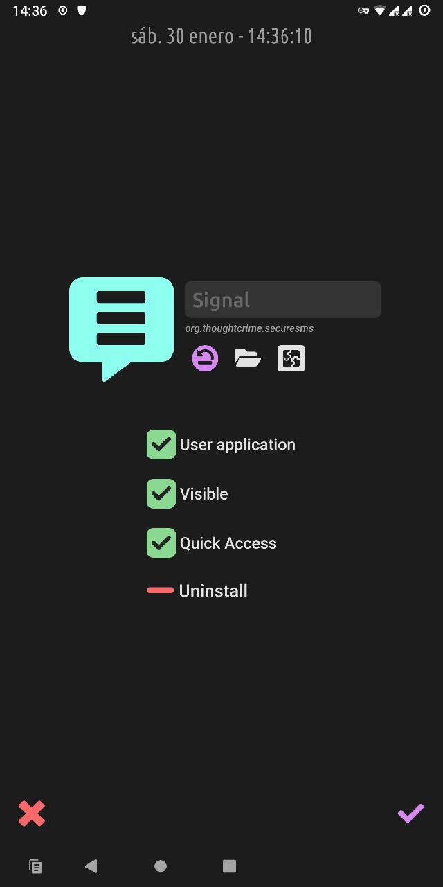

# Application settings

Long-press any application icon to open its settings.

{: style="height:720px" }

- {: style="height:32px" }  
Reset the default [icon](icons.md)
- {: style="height:32px" }  
Select a custom [icon](icons.md) file (`.jpg`, `.png` or `.svg`)
- {: style="height:32px" }  
Select an icon from the provided [icon set](icons.md)
- You can change the application label with the top field. Leave it empty to reset to the original/official name.
- *RxLauncher* automatically detects which applications are *system* or *user applications*, and [use this information to filter them](settings.md) in the application list. You can change this if *RxLauncher* is wrong.
- You can easily hide an application from the list. Get to the *RxLauncher* [settings](settings.md) to show again hidden applications if you need.
- Select [*quick access*](quickaccess.md) to permanently show the application in the right bar.
- *Uninstall* will uninstall the application from the system. Note that some system apps can not be removed without rooting the phone.

!!! note
    URLs / Web applications you may have added have the exact same settings and work in *RxLauncher* the same way as any application.

{: style="height:720px" }
