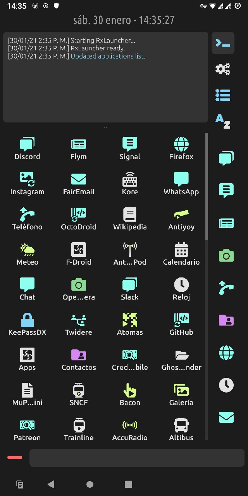

# RxLauncher Documentation

Yet Another Android Launcher, but different.

See the source on [GitHub](https://github.com/Rainbox-dev/RxLauncher/).

{: style="height:720px;"}

[TOC]

## Introduction

RxLauncher is a launcher for Android. The launcher is the application you see when you touch the *Home* button, and which usually shows a list of installed applications so that the user can select and launch them.

It has been developped in application of the [RxUI design principles](http://rxui-docs.rainboxlab.org) used in all software developped by [RxLaboratory](https://rainboxlab.org). It began as an exercise to learn how to develop *Android* applications, but is mature enough to be shared with the rest of the world if you'd like to try something different for your launcher.

These are the main features, and some guidelines followed when developping it:

- RxLauncher is **free software**, which means you are free to use it any way you want, and [it is **open source**](https://github.com/Rainbox-dev/RxLauncher/).
- The application **respects your privacy**: it does not collect nor send any data from your phone.
- It is **lightweight**, and is not bloated with unnecessary heavy features, but has anything you need to use your phone in an efficient way:
    - [You can **change any app icon and name**](appsettings.md), and you're not restricted to icon packs: just select any icon on your phone, **design your own**!
    - Default icons for the apps are replaced by a **default generic icon**, so that your phone looks exactly the way you want.
    - [The launcher comes with a **huge icon set**](icons.md), always growing, but all are generic: we don't want to make any advertising for any app or brand.
    - [You can **add any URL** to any website](url.md) to the launcher, and it will be considered as any other app. This is a great way to replace bloated and privacy breaker applications by simple web applications.
    - [A quick access area](quickaccess.md) lists the applications which are the most important to you.
    - The launcher **keeps track of your use of the applications**, and is able to sort them according to how many times you launched them. Of course, this data is stored on your phone only and kept private from any other application.
    - [ You can easily uninstall](appsettings.md) any app from the launcher.
    - You can quickly [search for any app](search.md) to launch them.
    - It is **easy to use**.

*RxLauncher* has been developped using a [Fairphone](https://www.fairphone.com/en/) running [/e/](https://e.foundation/). We stronlgy encourage you to considern using to this phone and operating system as soon as you need to change your phone.  
It's been tested on *Samsung* and *Huawei* running *Android* too.

## Table of Contents

- [Installation](install.md)
- [First use](firstuse.md)
- [App settings](appsettings.md)
- [Icon set](icons.md)
- [RxLauncher settings](settings.md)
- [Quick Access](quickaccess.md)
- [Search app](search.md)
- [Add URL/Web App](url.md)

## License

### Software

The software this documentation is referring to is licensed under the ***GNU General Public License***.

**Copyright (C)  2020 Nicolas Dufresne and Contributors.**  
This program is free software; you can redistribute them and/or modify them under the terms of the GNU General Public License as published by the Free Software Foundation; either version 3 of the License, or (at your option) any later version.

This program is distributed in the hope that it will be useful, but WITHOUT ANY WARRANTY; without even the implied warranty of MERCHANTABILITY or FITNESS FOR A PARTICULAR PURPOSE. See the GNU General Public License for more details.

You should have received a copy of the *GNU General Public License* along with this program . If not, see [http://www.gnu.org/licenses/](http://www.gnu.org/licenses/).

{: style="height:75px;"} {: style="height:50px;"}

### Icons and other graphical elements

All graphical elements, especially icons, are from [***RxUI***](http://rxui-docs.rainboxlab.org) by Nicolas Dufresne and [RxLaboratory](https://rainboxlab.org) are licensed under [CC BY-NC-SA 4.0](https://creativecommons.org/licenses/by-nc-sa/4.0/).

**Copyright (C) 2021 Nicolas Dufresne and Contributors.**

[{: style="height:35px;"} {: style="height:35px;"} {: style="height:35px;"} {: style="height:35px;"}](https://creativecommons.org/licenses/by-nc-sa/4.0/)

### This Documentation

**Copyright (C)  2020 Nicolas Dufresne and Contributors.**  
Permission is granted to copy, distribute and/or modify this document under the terms of the GNU Free Documentation License, Version 1.3 or any later version published by the Free Software Foundation;  
with no Invariant Sections, no Front-Cover Texts, and no Back-Cover Texts.
A copy of the license is included in the section entitled "[Documentation License](licenses/gfdl.md)".

{: style="height:75px;"} {: style="height:50px;"}