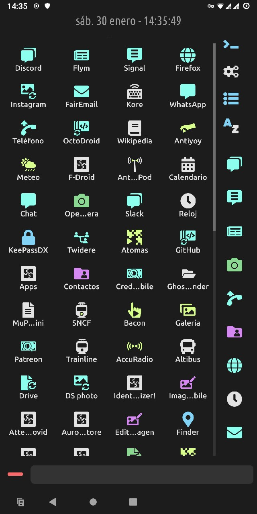

# Quick Access

{: style="height:720px;"}

You can select applications to be kept in the right bar at any time. Get to the [application settings](appsettings.md) and select *Quick Access*. If there is not enough room to show them all, you will be able to scroll on this quick access bar, so you can add as many as you want!

To remove an app from the quick access bar, just uncheck the option in its [settings](appsettings.md).