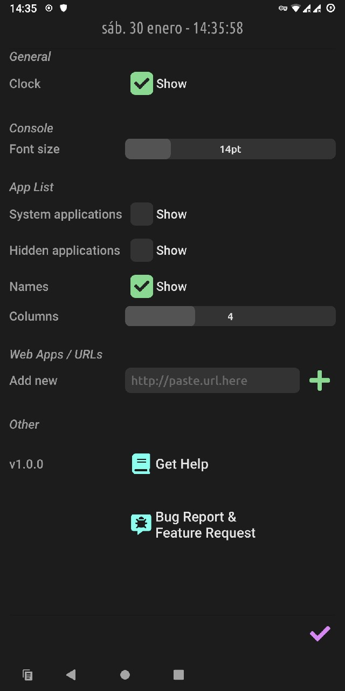

# Settings

{: style="height:720px;"}

In the settings you can adjust some options for the behavior of *RxLauncher*.

There you can show all applications by checking *System Applications* (and turn them to user applications if you need, by going to their specific [app settings](appsettings.md)), and you can also show again all hidden apps.

Use the *Add new Web App/URL* field to add shortcuts to your favorite web sites and applications. They will be added with the other applications, and you can customize their names and icons too.